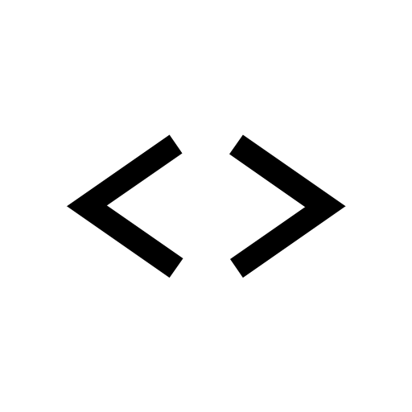

# CodeCollab

<div align="center">
  
  <h3>Real-time collaborative coding platform with integrated tools</h3>
</div>

## 🚀 Overview

**CodeCollab** is a powerful collaborative coding platform designed for real-time teamwork. It combines a feature-rich code editor with integrated whiteboarding, chat functionality, and GitHub integration to create a comprehensive environment for developers, educators, and teams to work together seamlessly.

## ✨ Key Features

- **Real-time Collaborative Editing**
  - Multiple users can edit code simultaneously with instant synchronization
  - User presence indicators and cursor tracking
  - Real-time feedback on who's typing and where

- **GitHub Integration**
  - Connect directly to GitHub repositories
  - Clone, commit, and push changes without leaving the platform
  - Manage repository access and permissions

- **Interactive Whiteboard**
  - Sketch diagrams, flowcharts, and visual concepts
  - Collaborate on design ideas in real-time
  - Integrate visual planning with code development

- **Integrated Chat System**
  - Text-based communication alongside code
  - Share ideas and discuss implementation details
  - Keep all project communication in one place

- **Multi-language Support**
  - Syntax highlighting for numerous programming languages
  - Code execution capabilities
  - Language-specific features and tools

- **Room-based Collaboration**
  - Create dedicated spaces for different projects or teams
  - Invite collaborators with simple sharing links
  - Manage permissions and access control

## 🛠️ Tech Stack

### Frontend
- **React** with TypeScript
- **Vite** for fast development and building
- **TailwindCSS** for styling
- **Socket.io** for real-time communication
- **CodeMirror** for the code editor
- **TLDraw** for whiteboard functionality
- **React Router** for navigation

### Backend
- **Node.js** with Express
- **Socket.io** for WebSocket connections
- **TypeScript** for type safety
- **OpenAI API** integration for AI assistance

## 📋 Prerequisites

- Node.js (v16 or higher)
- npm or yarn
- Git

## 🔧 Installation & Setup

### Clone the Repository

```bash
git clone https://github.com/shaikhsameer18/CodeCollabFinal.git
cd CodeCollabFinal
```

### Server Setup

```bash
cd server
npm install
npm run dev
```

### Client Setup

```bash
cd client
npm install
npm run dev
```

## 📖 Usage Guide

### Creating a Room
1. Navigate to the homepage
2. Enter a username
3. Click "Create New Room" or join an existing room with a code

### Inviting Collaborators
1. Share the room URL displayed in the address bar
2. Collaborators can join using the room code on the homepage

### Using the Code Editor
- Edit code in real-time with collaborators
- See everyone's cursors and edits as they happen
- Use the file explorer to navigate between files

### Using the Whiteboard
- Switch to whiteboard mode using the sidebar toggle
- Draw diagrams, flowcharts, or any visual content
- Collaborate in real-time with other room participants

### GitHub Integration
1. Connect your GitHub account using the GitHub button in the sidebar
2. Select repositories to work with
3. Commit and push changes directly from CodeCollab

## 🤝 Contributing

Contributions are welcome! Please feel free to submit a Pull Request.

1. Fork the repository
2. Create your feature branch (`git checkout -b feature/amazing-feature`)
3. Commit your changes (`git commit -m 'Add some amazing feature'`)
4. Push to the branch (`git push origin feature/amazing-feature`)
5. Open a Pull Request

## 📜 License

This project is licensed under the MIT License - see the [LICENSE](LICENSE) file for details.

## 🙏 Acknowledgements

- [React](https://reactjs.org/)
- [Socket.io](https://socket.io/)
- [CodeMirror](https://codemirror.net/)
- [TLDraw](https://www.tldraw.com/)
- [OpenAI](https://openai.com/)
